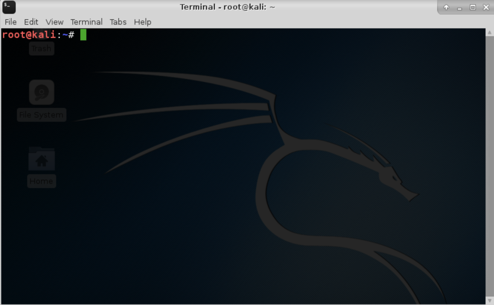
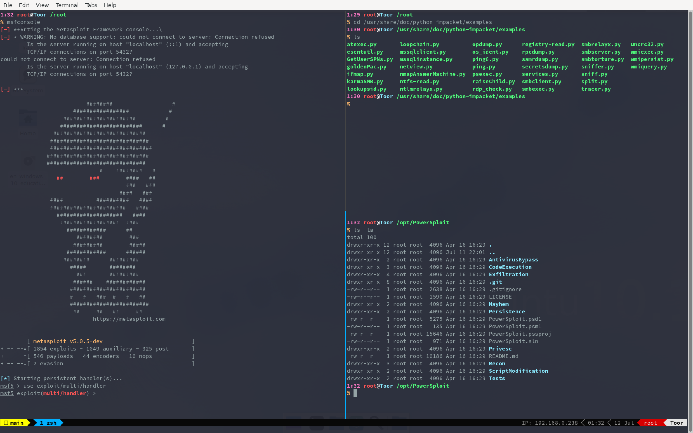

# Tmux-Jridley-Dracula

Move past the 16th century and make your terminal look like candy.
Very eye satsifying.

## Before

## After

#### How?
Run the script as root in either iTerm, xfce-terminal, or gnome-terminal.
### Make sure both these things are satisfied

## Major credit to @bchen p@n1ckn1f3
